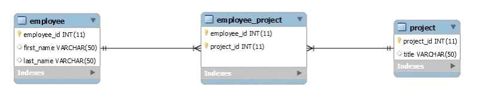

# What I Learnt Today

## Many-to-Many relationships

- a relationship that occurs when multiple records in a table are associated with multiple records in another table

In the relationship depicted above, an employee can be assigned to multiple projects and a project can be assigned to many employees, hence the many-to-many relationship.

A join table can be used to connect the employee with a project

Defining Many-to-Many relationships in a class

    @Entity
    @Table(name = "Employee")
    public class Employee { 
        // ...
    
        @ManyToMany(cascade = { CascadeType.ALL })
        @JoinTable(
            name = "Employee_Project", 
            joinColumns = { @JoinColumn(name = "employee_id") }, 
            inverseJoinColumns = { @JoinColumn(name = "project_id") }
        )
        Set<Project> projects = new HashSet<>();
    
        // standard constructor/getters/setters
    }

In the example above, the @ManyToMany annotation indicates that the class Employee has a many-to-many relationship with class Project. A join table (created by @JoinTable) called "Employee_Project" is established that connects the two tables. It joins the employee_id column with the project_id column.

        @Entity
        @Table(name = "Project")
        public class Project {    
            // ...  
        
            @ManyToMany(mappedBy = "projects")
            private Set<Employee> employees = new HashSet<>();
            
            // standard constructors/getters/setters   
        }
    
As can be seen above, the Project class also references the employee class

Mapped by attribute indicates that relation between the two tables has already been mapped so there isn't a need to map them again

